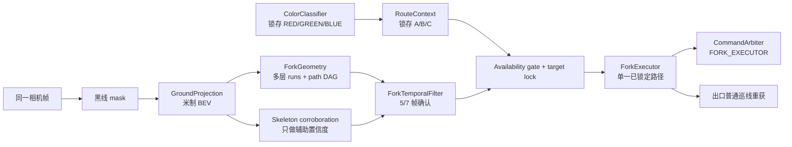
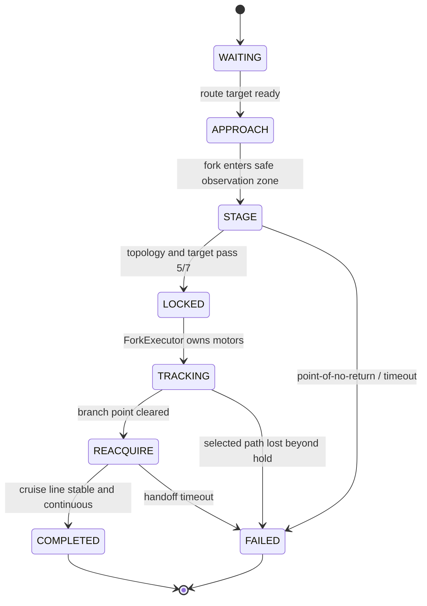

# 三岔口识别、选路与执行 Implementation Doc

> 文档状态：实施前设计稿
>
> 适用项目：`transbotse-project`
>
> 目标赛道：固定三岔，红色物料去 A、绿色物料去 B、蓝色物料去 C
>
> 结论先行：第一版采用 **固定相机 + 规范观察位 + 米制 BEV 多路径图 + 目标分支锁定 + 视觉闭环执行**；不采用最长轮廓选路，不把骨架端点数作为唯一判据，也不以定时盲转作为主方案。

## 1. 问题定义

赛道要求不是“看到岔路后自由规划”，而是两个相互独立的问题：

1. 上游颜色识别给出本次必须走的目的地：`RED → A`、`GREEN → B`、`BLUE → C`。
2. 三岔视觉确认 A/B/C 对应的左、直、右实际路径是否存在，并为已指定的那条路径生成可控制轨迹。

[赛道说明第 6 页](../race/赛道说明-final.pdf#page=6)明确给出了从物料区到三岔后前往 A/B/C 的关系。按小车去程朝向建立车体坐标：

| 物料颜色 | 目的地 | 车体方向 | `BranchTarget` | 数值编码 |
| --- | --- | --- | --- | --- |
| 红 | A | 左支路 | `A` | `+1` |
| 绿 | B | 直行支路 | `B` | `0` |
| 蓝 | C | 右支路 | `C` | `-1` |

颜色结果是**任务意图**，视觉分支是**环境事实**。任务意图不能把一条不存在或未看清的支路“加分加成存在”；必须先通过支路可用性门控，再选择与目标一致的候选。

## 2. 当前仓库审计结论

### 2.1 已经可以复用的能力

- [`vision.py`](../../transbot_race/vision.py) 已有黑线预处理、多扫描带、普通单路径拟合和丢线处理。
- [`capture_geometry.py`](../../transbot_race/capture_geometry.py) 已有锚点连通域、Zhang-Suen 细化、端点路径追踪和几何调试图。
- [`ring_entry.py`](../../transbot_race/ring_entry.py) 已有选中路径前视点、路径跳变抑制、短时缺帧保持、曲率降速、角速度斜率限制和安全丢路事件。
- [`control.py`](../../transbot_race/control.py) 已预留 `ControlOwner.FORK_EXECUTOR`，可继续使用单一电机仲裁器。
- [`race_runner.py`](../../apps/race_runner.py) 已是单相机、单主循环、单电机所有者架构；不需要增加第二个相机进程。
- [`race_debug_app.py`](../../apps/race_debug_app.py) 已能通过四个地面点计算 pixel-to-ground homography。
- [`config.py`](../../transbot_race/config.py) 已有 `GroundProjectionConfig` 和 `mission.fork_branch` 外形。

### 2.2 必须补齐或修正的缺口

- [`mission.py`](../../transbot_race/mission.py) 当前 `FORK` 是 `DetectorKind.NONE + ExecutorKind.CRUISE`，没有专用检测器或执行器。
- 当前任务顺序没有 `COLOR_CLASSIFY` 和 `UNLOAD`；`fork_branch` 只被校验，没有参与运行时选路。
- 当前 `capture_geometry` 的分叉判据只接受同时出现左右方向的 3–4 个骨架端点，随后仍把方向压成 `±1`；不能把中间 B 支路当作一等路径。
- 当前骨架端点法曾在低照度阴影中产生 14–19 个端点，说明“端点数 = 拓扑”的单判据会制造假三岔。
- 普通 `LineFollower` 会较早收敛到一个底部连通路径；在多路径场景里一旦早选错，后续没有 A/B/C 候选可供任务层纠正。
- 当前 [`race_config.json`](../../configs/race_config.json) 中的 homography 是退化的零矩阵，运行时也没有实际消费它，不能直接用于三岔。
- 当前标定 UI 记录的是扩展 crop 坐标到 `(forward, left)` 的映射；新实现必须明确它和整帧、ROI、BEV 像素之间的原点变换，避免重复平移。

### 2.3 已有外部原型的接线边界

已经检查过的 `/Users/macalan/Downloads/color_route` 可以作为颜色 session 的起点：

- `route_selector.py` 已有矩形色卡、HSV、winner margin、10 帧中 8 帧确认和结果锁存。
- 其当前 `DEFAULT_ROUTE_MAP` 是 `red → left`、`green → straight`、`blue → right`，接入时在唯一边界转换成 `A/B/C`，不要让字符串方向流遍整个系统。
- `recognition_session.py` 已把搜索、确认、超时和蜂鸣事件与相机/电机解耦，适合由 runner 的现有单相机循环调用。
- `camera_test.py` 只用于独立验证；正式 runner 不能让它再打开一次相机。
- 只有 `decision.stable is True` 才能写入 `RouteContext`；拒识或超时保持停车。

`/Users/macalan/Downloads/turn_sign_api` 是环岛前的左右标志原型：它的输出只写 `ring_entry_direction/ring_exit_direction` 对应的运行时任务上下文，不参与 A/B/C 三岔选择。两个识别器都应复用 runner 的同一帧，并且只在各自 mission session 激活。

## 3. 范围与非目标

### 3.1 本阶段必须完成

- 三岔出现、分叉点和入口主干的可靠检测。
- 同一帧保留 A/B/C 多条候选，不在感知早期丢弃未选路径。
- 按颜色锁存结果选择目标分支，并确认该分支确实可用。
- 从三岔前低速接管，到目标出口普通黑线稳定重获后交还巡线器。
- 错误、遮挡、目标分支缺失、相机标定失效时安全停车。
- 可离线重放的 debug artifact、telemetry、测试集和验收门槛。

### 3.2 本阶段不做

- 不引入 SLAM、Nav2、全局地图或自由路径规划。
- 不引入深度网络做 BEV 或三岔分类；固定赛道首版没有这个成本收益比。
- 不把“最长路径”“最大轮廓”或“离图像中心最近”当作分支选择规则。
- 不让颜色结果绕过几何可用性检测。
- 不新增独立相机进程，不让多个模块同时向电机写命令。
- 不以固定时间、固定角速度盲转作为主要控制；它最多是后续有充分实车数据后的限时降级策略。
- 去程三岔完成之前不同时实现返程合流；返程属于后续独立状态和判据。

## 4. 总体架构



核心拆分：

- `ColorClassifier` 只回答任务要求走哪里。
- `ForkGeometry` 只回答画面里有哪些从入口主干连通的可行路径。
- `ForkTemporalFilter` 只确认拓扑和目标支路的时序稳定性。
- `ForkExecutor` 接受一条已经锁定的路径；接管后不再每帧重新做 A/B/C 决策。
- `CommandArbiter` 保持唯一电机写入点。

## 5. 坐标、枚举与数据契约

### 5.1 坐标约定

全项目在三岔模块边界使用以下明确约定：

- 原图坐标：`u` 向右，`v` 向下，单位 pixel。
- 车体地面坐标：`x` 向前，`y` 向车体左侧，单位 metre。
- 偏航/曲率：左转为正，右转为负。
- BEV 图像坐标只作为渲染细节；业务结构体存 `(x, y)` 米制点，不能把 BEV pixel 当 metre 透传。
- `invert_turn` 只允许在最终车体角速度到硬件命令的单一边界应用一次；不能继续沿用图像 `u` 的符号后再重复取反。

### 5.2 建议的新类型

```python
class BranchTarget(IntEnum):
    C = -1       # robot-right
    B = 0        # straight
    A = 1        # robot-left


@dataclass(frozen=True, slots=True)
class ForkPathCandidate:
    target: BranchTarget
    ground_path: tuple[tuple[float, float], ...]
    image_path: tuple[tuple[float, float], ...]
    branch_point_m: tuple[float, float]
    exit_lateral_m: float
    exit_heading_rad: float
    visible_length_m: float
    support_ratio: float
    gap_bands: int
    curvature_cost: float
    score: float


@dataclass(frozen=True, slots=True)
class ForkObservation:
    found: bool
    reason: str
    branch_point_m: tuple[float, float] | None
    incoming_heading_rad: float | None
    candidates: tuple[ForkPathCandidate, ...]
    topology_confidence: float
    skeleton_confidence: float


@dataclass(frozen=True, slots=True)
class ForkDecision:
    target: BranchTarget
    selected: ForkPathCandidate
    votes: int
    confidence: float
```

不建议继续把三岔塞进 `CaptureGeometryObservation.direction`：该字段当前承担环岛/转弯的 `±1` 语义，无法无歧义表达 B，也容易让旧的 `roundabout_direction` 误控制三岔。

### 5.3 运行时路线上下文

增加运行时、单次任务不可变的 `RouteContext`：

```python
@dataclass(slots=True)
class RouteContext:
    material_color: MaterialColor | None = None
    outbound_fork_target: BranchTarget | None = None
    fork_target_locked: bool = False
    outbound_fork_completed: bool = False
```

颜色投票成功时一次性写入 `material_color` 和 `outbound_fork_target`；进入 `FORK_LOCKED` 后禁止修改。静态 JSON 配置只允许在 debug/无颜色模式下注入测试目标，不能在正常比赛里代替运行时识别结果。

## 6. 相机视角和地面投影

相机问题优先于阈值问题。只有在一个可重复的观察位里同时看到以下四项，视觉算法才有充分信息：

1. 小车前方入口黑线；
2. 实际分叉点；
3. 左、直、右三个出口各一段足够长的方向线；
4. 不被车体、机械臂、赛道边框或画面裁剪遮挡的地面区域。

### 6.1 固定 staging pose

- 颜色识别完成时小车已停车或低速，随后以 `fork_approach_v` 进入三岔观察区。
- 在离分叉点尚有安全制动距离处进入 `FORK_STAGE`，可先完全停车 0.3–0.5 s 采集稳定帧。
- 若静态画面看不全三个出口，调整顺序应为：观察点后移 → 调小相机俯角/扩大垂直视野 → 更宽 FOV。动态云台是最后选项，因为它会使 homography 随舵机角度变化。
- 相机分辨率、crop、曝光、白平衡、舵机角度、支架位置都属于标定版本的一部分。任一项改变必须重标定或加载对应版本。

`APPROACH → STAGE` 的主触发使用 BEV 中的部分拓扑和 branch point 前向距离：入口 root 连通，至少两条远端路径开始持续分离，并且 `branch_point.x` 进入测得的 staging 距离。若一直得不到可靠 branch point，则从颜色区离开后的 `approach_timeout_sec` 只作为安全上限，到时停车；不能用固定时间直接提交方向。point-of-no-return 则由最低转弯半径、当前速度和实测制动距离共同测得，未确认决策时不允许越过。

### 6.2 homography 契约

建议把现有标定升级为“整帧像素 → 车体地面 `(x, y)`”，以减少 crop 原点错误。如果暂时保留 crop 标定，必须在 `GroundProjector` 内统一完成：

```text
full-frame pixel
  -> subtract exact expanded-crop origin
  -> apply H_crop_to_ground
  -> metric ground point (x forward, y left)
```

`GroundProjector` 初始化时必须校验：

- 恰好 9 个有限数；
- 矩阵秩为 3，行列式不接近 0；
- 近场左右点投影后 `x` 近似相等且左点 `y > 0`、右点 `y < 0`；
- 远场点的 `x` 大于近场点；
- 配置中的 frame size、crop、相机角度和标定元数据一致；
- 4 个拟合点之外至少 6 个测量点验证，首轮目标 RMS 误差不超过 1.5 cm。

任何校验失败都必须使三岔 detector 标记 `calibration_invalid` 并停车，不能静默退回图像空间猜路径。

### 6.3 BEV 范围

当前 `200 × 260 @ 500 px/m` 只覆盖约 `0.40 m × 0.52 m`，很可能看不完整个三岔。首轮采数建议把范围显式配置为：

```text
x: 0.05 m .. 0.85 m
y: -0.45 m .. +0.45 m
resolution: 300 .. 400 px/m
```

最终范围必须由 staging 静态图确定，以“能看全三条出口 + 不把远处墙缝带入”为准，而不是直接照抄上述数值。二值 mask warp 使用 nearest-neighbour；warp 后只做小核 closing 和 opening，避免把相邻支路粘成一片。

## 7. 三岔几何算法

### 7.1 为什么主算法选 BEV scan-band path graph

透视原图中，横向像素偏差随距离变化；同一条 25 mm 黑线在近场和远场宽度不同。BEV 将其近似统一到米制平面，使以下阈值有物理意义：线宽、分支间距、最大侧移、最小可见长度、分叉点漂移和前视距离。

现有 scan-band 方案也比纯 skeleton 更适合实车主路径：它对短毛刺、边缘锯齿和局部断线更容易施加宽度与支持率约束。skeleton 保留为拓扑辅助证据和 debug，不作为唯一触发器。

### 7.2 每帧处理流程

1. 从 runner 的同一原始帧取固定 fork ROI；不另开相机。
2. 复用 `preprocess_blackline` 生成黑线 mask。
3. 用 `GroundProjector` 将 mask 投到米制 BEV。
4. 限制到 fork ground ROI，剔除车体下沿、远端墙面和已知非赛道区域。
5. 沿 `x` 方向设置约 12–20 个横向 band；每个 band 在 `y` 方向查找黑色 run。
6. 对每个 run 记录中心 `y`、宽度、像素支持率、局部方向和质量。
7. 相邻 band 的 run 按最大侧移、最大转角、宽度连续性和允许缺口连边，形成有向无环图。
8. 近场入口主干是唯一 root；枚举 root 到远场的候选 path。
9. 在入口路径首次稳定分裂处估计 branch point；短分裂后立即合并的噪声不算出口。
10. 对每条候选做 A/B/C 分类、可用性门控和评分。
11. skeleton graph 仅对 branch point、有效长分支数量和短毛刺比例给辅助置信度。

### 7.3 run 节点和连边

每个 band 内先对二值列求 run，而不是只求全局质心。一个 band 可同时保留多个节点：

```python
BandRun(
    x_m,
    y_center_m,
    width_m,
    support_ratio,
    heading_hint_rad,
)
```

从 band `i` 到 `i+1` 的边至少满足：

```text
abs(dy) <= max_lateral_step_m
abs(dy / dx) <= max_slope
width in physical line-width range
gap_bands <= max_gap_bands
```

每个节点允许连接多个下一层节点。这里不能像普通巡线那样只留一个“最佳后继”，否则最早的歧义会永久删除另外两条合法路径。

### 7.4 root 和分叉点

- root 必须来自车体近场中心附近、与前一帧普通巡线轨迹相符的 run。
- 如果近场没有可信入口主干，不允许仅凭远场三条黑线触发接管。
- 两条 path 的公共前缀结束位置定义为候选 branch point。
- branch point 只有在至少两条达到最小可见长度的 path 分离后才有效。
- 三岔任务期望 A/B/C；如果只有两条可见，应报告部分 topology，继续低速/停车观察，不得把两条强行重命名为三条。

### 7.5 A/B/C 分类

所有分类都相对于入口主干坐标，不相对于画面中心：

1. 用 branch point 前的一段路径拟合入口切向。
2. 将入口切向向远端外推，并把候选出口点变换到这个入口局部坐标；这样小车斜着进入时不会把图像绝对左/右误当作车体左/右。
3. 在固定前视距离 `branch_classify_lookahead_m` 处读取横向位移和出口 heading。
4. 结合位移与 heading 分类：
   - A：横向位移明显为正，或 heading 明显左偏；
   - B：横向位移和 heading 均在直行门限内；
   - C：横向位移明显为负，或 heading 明显右偏。
5. 如果横向与 heading 给出相反类别，标记 `ambiguous_classification`，不输出可用候选。

B 必须是显式类别，不能实现成“既不是左也不是右就选最长”。

### 7.6 可用性门控与评分

先门控，后评分。候选至少满足：

- 与入口 root 连通；
- 通过 branch point 后的可见长度达到阈值；
- 黑线宽度和支持率合理；
- 缺失 band 数不超限；
- 曲率、切向变化符合差速小车能力；
- 不越出已标定可行地面区域；
- 分类不含糊。

通过门控后再评分：

```text
score =
    w_anchor   * incoming continuity
  + w_length   * visible length
  + w_support  * mask support
  + w_temporal * previous-frame consistency
  - w_gap      * missing bands
  - w_curve    * curvature roughness
  - w_width    * physical width error
```

选择流程是：

```text
all candidates
  -> availability gate
  -> group by A/B/C
  -> take the best candidate inside the already requested target group
  -> require absolute confidence and margin over same-class alternatives
```

目标组为空时返回 `target_unavailable` 并停车，不得自动改走另外一组。

### 7.7 skeleton 辅助确认

可复用当前 Zhang-Suen 细化，但需先完成三项修正：

- 把相邻 junction pixels 合并为一个 junction cluster；
- 剪掉小于物理长度门限的 spur；
- 从入口 root 追踪，而不是把所有孤立端点计入分支。

skeleton 只用于以下加分/减分：

- branch point 附近是否有 degree ≥ 3 的 junction cluster；
- 从 junction 到远端是否有足够长、彼此分离的 branch；
- 短 spur 数量是否异常；
- skeleton branch heading 是否与 scan-band path 一致。

出现阴影导致的 14–19 个端点时，应得到 `skeleton_noisy`，降低置信度或拒绝，而不是误判为“更多分支”。

### 7.8 时序确认

首轮采用 7 帧窗口中的 5 帧确认：

- 不是对 A/B/C 意图投票；意图早已由颜色锁存。
- 投票对象是“三岔拓扑稳定”和“指定目标支路可用”。
- 同一目标候选的 branch point 漂移、前视点漂移和 heading 差必须在门限内。
- 未确认前可低速接近或停车；确认后生成一次 `ForkDecision` 并锁定。
- 一旦锁定，任何后续帧都不能把 A 改成 B/C，或把 B 改成更显眼的侧路。

在约 13 Hz 主循环下，5/7 大约需要 0.5 s，适合停车/极低速 staging。若后续主循环频率变化，配置应按时间目标重新换算，而不是机械保留帧数。

## 8. ForkExecutor 和多路径选择

### 8.1 状态机



建议内部状态：

| 状态 | 行为 | 电机所有者 |
| --- | --- | --- |
| `WAITING` | 等待颜色结果和进入 fork session | `CRUISE` |
| `APPROACH` | 普通线低速接近，监测 fork ROI | `CRUISE` |
| `STAGE` | 原子接管后停车或受限 creep，完成 5/7 确认 | `FORK_EXECUTOR` |
| `LOCKED` | 固化目标和候选轨迹，初始化进度 | `FORK_EXECUTOR` |
| `TRACKING` | 只跟踪锁定路径 | `FORK_EXECUTOR` |
| `REACQUIRE` | 继续保持选路，同时验证普通单线 | `FORK_EXECUTOR` |
| `COMPLETED` | 原子交还普通巡线并推进 mission | `CRUISE` |
| `FAILED` | latch 安全停车，等待人工 reset | `SAFETY_STOP` |

### 8.2 路径锁定

`ForkDecision` 接受时保存：

- `BranchTarget`；
- 当前米制 polyline；
- branch point；
- 路径的单调进度索引；
- 前一帧目标前视点和切向；
- 接管时间、接管位姿代理量和累计行驶距离。

后续视觉更新只能在**同一 target** 内关联到旧 path。关联需要限制 branch point、局部前视点、heading 和曲率变化。无法关联时先短时保持旧轨迹；不能跳到其他 target。

### 8.3 实际路径与模板路径

主路径使用每帧观测并与锁定目标关联后的 BEV polyline。可以为 A/B/C 保存三条在 staging pose 下标定的 canonical/virtual lane，但它们只做：

- path graph 搜索先验；
- 短遮挡时的有限时长形状先验；
- 判断视觉候选是否离谱。

当前底盘没有足够可靠的轮速里程计来支持长时间纯模板开环，因此不能在锁定后完全丢掉视觉、只按固定时间执行转弯。

### 8.4 米制 pure pursuit

从锁定 polyline 上选择车体前方 lookahead 点 `(x_L, y_L)`：

```text
kappa = 2 * y_L / (x_L² + y_L²)
omega = clamp(v * kappa, -max_w, +max_w)
```

速度按曲率和接近出口程度调节：

```text
v = min(v_max,
        curvature_speed_limit(abs(kappa)),
        approach_speed_limit(remaining_length))
```

再对 `omega` 做与 `RingEntryExecutor` 同类的 slew limit。路径进度搜索只允许从上一帧进度向前一个有限窗口内推进，避免在交叉/相邻分支间跳到错误的“最近点”。

### 8.5 视觉缺帧和丢路

- 锁定后短暂缺失不超过 `hold_path_frames`：沿上一条已确认轨迹以降速命令继续。
- 超过保持帧数但未超过 `route_lost_frames`：输出零速或极低速等待，不切回普通巡线。
- 达到 `route_lost_frames`：产生 latch 的 `FORK_ROUTE_LOST`，安全停车。
- 丢路期间永远不能调用普通 `LineFollower` 自动选择画面里最显眼的另一条线。

### 8.6 完成和交接条件

必须同时满足以下条件才从 fork executor 交回 cruise：

- 已驶过 branch point；
- 累计行驶距离超过最小值；
- 锁定支路的进度单调接近出口；
- 普通 `visual_fit` 连续至少 `handoff_confirm_frames` 为 found；
- `visual_fit` 与锁定出口在横向、heading 和方向上连续；
- fork vertex 已在车后或退出有效 ROI；
- 当前不处于路径保持或 route-lost 状态。

不要只用“画面不再是 fork”作为完成条件；视角变化会让同一物理三岔过早变成单线。

## 9. mission 与 runner 接入

### 9.1 目标任务链

本次接入后的去程最小链路：

```text
RING_EXIT
  -> COLOR_CLASSIFY
  -> FORK
  -> UNLOAD
  -> RETURN
```

转向标识识别未来位于环岛之前；它控制环岛方向，不应复用来控制三岔。三岔只消费 `RouteContext.outbound_fork_target`。

### 9.2 mission 枚举

计划新增：

```python
class CourseSession(str, Enum):
    ...
    COLOR_CLASSIFY = "color_classify"
    FORK = "fork"
    UNLOAD = "unload"

class DetectorKind(str, Enum):
    ...
    COLOR = "color"
    FORK = "fork"

class ExecutorKind(str, Enum):
    ...
    FORK = "fork"
    TERMINAL = "terminal"
```

`SESSION_MAP[FORK]` 改成 `DetectorKind.FORK + ExecutorKind.FORK`。颜色 session 完成前不得进入 fork target lock；fork 完成事件只能由 `ForkExecutor.COMPLETED` 发出。

### 9.3 runner 每帧顺序

```python
frame = camera.read()
cruise_fit = line_follower.analyze(frame)

if mission.session == COLOR_CLASSIFY:
    color_result = color_session.step(frame)
    if color_result.locked:
        route_context.lock_color_and_target(color_result)
        mission.phase_completed()

elif mission.session == FORK:
    observation, debug = fork_detector.analyze(frame, cruise_fit)
    decision = fork_filter.update(observation, route_context.outbound_fork_target)
    result = fork_executor.step(
        observation=observation,
        decision=decision,
        cruise_fit=cruise_fit,
        now=now,
    )
    command = fork_executor.control(result.path) if result.owns_control else cruise_command
    arbiter.submit(ControlOwner.FORK_EXECUTOR, command)
    if result.completed:
        mission.phase_completed()
```

检测、确认和执行可在同一主循环运行，但只有当前 mission session 的 detector 有资格产生事件；保持现有严格 detector gating。

### 9.4 电机所有权

- `APPROACH` 中仍由 cruise 低速跟入口线。
- 进入 `STAGE` 的同一帧原子切换到 `ControlOwner.FORK_EXECUTOR`，由它执行停车或限速 creep；确认窗口期间不能让 cruise 继续把车带过安全线。
- `STAGE` 到 `COMPLETED/FAILED` 始终由 `ControlOwner.FORK_EXECUTOR` 持有，不能出现一帧双写。
- 任何 calibration invalid、target unavailable 超时、route lost 都通过现有安全停止通道 latch。
- 只有明确 reset 才能解除失败 latch。

## 10. 文件级实施计划

### 10.1 新文件

| 文件 | 职责 |
| --- | --- |
| `transbot_race/ground_projection.py` | homography 校验、frame/crop/ground/BEV 转换、标定元数据检查 |
| `transbot_race/fork_geometry.py` | BEV runs、DAG、branch point、A/B/C 候选、skeleton 辅助、debug overlay |
| `transbot_race/fork.py` | `ForkTemporalFilter`、`ForkExecutor`、路径关联、pure pursuit、事件定义 |
| `tests/test_ground_projection.py` | 标定合法/退化/坐标方向/往返误差测试 |
| `tests/test_fork_geometry.py` | synthetic A/B/C、阴影、毛刺、断线、错支路更长等感知测试 |
| `tests/test_fork.py` | 5/7 确认、锁定、丢路、所有权、交接和控制符号测试 |

### 10.2 修改文件

| 文件 | 计划修改 |
| --- | --- |
| `transbot_race/config.py` | 新增 `ForkConfig`、标定 metadata、明确 BEV extent |
| `transbot_race/mission.py` | 增加颜色/三岔/卸载 session、detector/executor 和严格 gate |
| `transbot_race/control.py` | 使用已有 `FORK_EXECUTOR`；必要时补 fork route-lost reason |
| `apps/race_runner.py` | 构造 detector/filter/executor、当前 session 调度、telemetry 和事件接线 |
| `apps/race_debug_app.py` | 标定验证点、BEV 预览、所有候选/目标前视点 overlay |
| `configs/race_config.json` | 写入实测有效 H、相机元数据和经数据集确定的 fork 参数 |

### 10.3 复用边界

- 复用 `preprocess_blackline`，但不要复用普通 `fit_line_trajectory` 来生成多分支。
- 可抽取 `capture_geometry` 的 skeleton helper；抽取前先为现状增加 characterization tests，避免破坏环岛和直角弯。
- 复用 `RingEntryExecutor` 的连续性过滤、短时保持、slew limit 和安全事件模式；不要继承它的 `direction = ±1` 数据模型。
- 复用 `moving_follow_handoff_ready`，外加与锁定出口连续性条件。

## 11. 初始配置草案

以下全部是**采数启动值，不是比赛最终值**：

```json
{
  "fork": {
    "bev_x_min_m": 0.05,
    "bev_x_max_m": 0.85,
    "bev_y_min_m": -0.45,
    "bev_y_max_m": 0.45,
    "bev_pixels_per_meter": 350.0,
    "band_step_m": 0.04,
    "expected_line_width_m": 0.025,
    "line_width_tolerance_m": 0.018,
    "max_lateral_step_m": 0.075,
    "max_gap_bands": 1,
    "branch_classify_lookahead_m": 0.22,
    "straight_lateral_max_m": 0.045,
    "side_lateral_min_m": 0.060,
    "min_exit_visible_length_m": 0.16,
    "confirm_window_frames": 7,
    "confirm_required_frames": 5,
    "max_branch_point_drift_m": 0.06,
    "max_target_point_drift_m": 0.08,
    "stage_hold_sec": 0.4,
    "stage_trigger_vertex_x_m": 0.50,
    "approach_timeout_sec": 3.0,
    "approach_v_mps": 0.03,
    "tracking_v_max_mps": 0.05,
    "tracking_v_min_mps": 0.018,
    "max_w_radps": 0.22,
    "hold_path_frames": 4,
    "route_lost_frames": 6,
    "min_complete_distance_m": 0.12,
    "handoff_confirm_frames": 4
  }
}
```

约束关系应在配置加载时校验，例如：

- `required <= window`；
- `straight_lateral_max < side_lateral_min`，两者中间形成拒绝带；
- `hold_path_frames < route_lost_frames`；
- BEV 范围包含车前所有验证点；
- `v_min <= v_max`；
- 有效制动距离小于 staging 到 point-of-no-return 的距离。

## 12. 调试与可观测性

每个 fork frame 至少记录：

- 原图和实际 fork ROI；
- 原图 mask、BEV mask 和 homography version；
- 每个 band 的所有 runs；
- DAG 所有连边与被拒绝原因；
- 入口 root、branch point；
- A/B/C 全部候选，不只画被选中的一条；
- 每条候选的长度、支持率、gap、heading、分类和 score；
- skeleton、junction cluster、剪枝前后端点数；
- `RouteContext` 目标、target availability 和 gate reason；
- 5/7 窗口内容、decision confidence；
- executor state、control owner、path progress、lookahead point；
- `v/w` 原始值、限幅值、slew 后值；
- handoff 条件逐项真假；
- calibration invalid、timeout、route lost 等 latch 原因。

debug overlay 建议固定颜色：A/左为红，B/直为绿，C/右为蓝；“目标”再用白色粗线/前视圆标记，避免候选颜色与物料颜色语义混淆时只看颜色不看标签。

## 13. 失败策略

| 故障 | 检测方式 | 行为 |
| --- | --- | --- |
| homography 退化或版本不匹配 | 初始化校验失败 | fork session 禁止运行，安全停车 |
| 相机被碰动 | 验证点误差/地面线宽长期异常 | 标记需重标定，停车 |
| 未收到颜色结果 | `RouteContext.target is None` | 不进入目标锁定，停车 |
| 看不到三岔 | topology 5/7 未通过 | 低速到观察上限，随后停车 |
| 指定支路不可见 | target group 为空 | 停车重试，不改走其他支路 |
| 阴影产生大量 spur | skeleton noisy + run width/support 异常 | 拒绝该帧 |
| 两支路分类含糊 | lateral/heading 冲突 | 拒绝该候选 |
| 错误支路更长更黑 | target group 先行选择 | 仍只选指定 target |
| 接管后短暂遮挡 | path hold 未超限 | 降速保持锁定 path |
| 接管后持续丢路 | `route_lost_frames` 达到 | latch 安全停车 |
| 普通巡线过早看到邻路 | handoff 连续性不通过 | ForkExecutor 继续持有 |
| 超过 point-of-no-return 仍未确认 | 距离/时间预算耗尽 | 停车，不带疑问进入路口 |

## 14. 测试计划与验收标准

### 14.1 标定测试

- 单元测试退化零矩阵、NaN、错误点序、左右反转、错误 crop origin。
- 4 个拟合点外至少 6 个地面测量点；保存图像点、真实坐标和误差。
- 目标 RMS ≤ 1.5 cm，最大误差 ≤ 3 cm；不达标先修相机/标定，不调 fork 阈值掩盖。
- 拆装相机、调整舵机、切换分辨率后验证必须失败，直到加载正确版本。

### 14.2 synthetic 几何测试

用米制地面 polyline 画 25 mm 黑线，再用逆 homography 投影到相机视角。至少覆盖：

- 标准 A/B/C 三支路；
- 目标为 A、B、C 各一遍；
- 小车斜着进入，使入口主干和图像竖直方向明显不一致；
- 非目标支路故意比目标更长、更宽、更靠中心；
- 中间 B 轻微偏斜，仍应为 B；
- 缺失 A/B/C 中任一条，目标缺失时必须拒绝；
- 仅普通直线、普通弯、环岛局部，不得误触发；
- 地面阴影、宽暗区、反光、墙缝；
- 1–2 band 断线、短 spur、junction blob；
- 相机左右偏移和航向误差；
- branch point 位于视野边缘；
- 只有两条出口或出现额外假路径。

关键断言：错误支路再显眼也不能覆盖 `BranchTarget`；锁定后 branch swap 次数必须为 0。

### 14.3 真实数据集

在写死最终阈值前，采集从颜色区停车开始、经过三岔直到出口重获的完整视频。建议最低覆盖：

- 每个目标分支至少 20 段有效 clip；
- staging 横向左/中/右三种偏移；
- heading 左偏/正/右偏三种；
- 日间、夜间、比赛补光；
- 干净赛道、轻微胶带反光、可复现阴影；
- 成功和应拒绝样本都保留。

标签至少包括：

- fork 首次信息充分帧；
- branch point；
- A/B/C availability；
- 指定 target；
- point-of-no-return；
- branch cleared；
- 普通巡线可安全接回帧。

按“整段视频”划分 train/tune/held-out，不能把同一段相邻帧拆到两边制造虚高成绩。

### 14.4 离线 replay 验收

- 非三岔 clip 的错误接管：0。
- held-out clip 中已确认决策的目标分支精度：100%；宁可拒绝也不能错走。
- 在 point-of-no-return 前完成确认的比例：≥ 95%。
- 锁定后的目标切换次数：0。
- 持续丢路到停车命令：≤ 0.5 s。
- fork detector 在目标树莓派上的 p95：≤ 25–30 ms。
- 完整 runner p95：≤ 75 ms，保持当前约 13 Hz 控制周期。

### 14.5 实车分阶段验收

1. **Shadow mode**：正常巡线，fork 模块只记录，不拿电机所有权。
2. **静态 staging**：人工把车放在偏移网格上，检查 A/B/C 和标定误差。
3. **低速单分支**：每个 A/B/C 白天 10 次、夜间 10 次，无错支路、无越线。
4. **颜色到三岔联调**：颜色锁存到 branch target 的映射 30/30 正确。
5. **去程全链路**：环岛出口、颜色、三岔、卸载连续运行。
6. **返程另开阶段**：去程稳定后再设计三岔合流/原路返回，不共用去程触发条件。

## 15. 实施顺序

### Phase 0：先定视角和数据

- [ ] 固定相机支架、舵机角度、曝光/白平衡和分辨率。
- [ ] 确定 staging pose，静态确认三条出口同时可见。
- [ ] 修复并验证 homography，录制标定 metadata。
- [ ] 采集第一批多偏移、多光照视频。

### Phase 1：离线感知

- [ ] 实现 `GroundProjector` 和退化校验。
- [ ] 实现 BEV band runs 和多后继 DAG。
- [ ] 实现 root、branch point、A/B/C 候选和 availability gate。
- [ ] 增加 skeleton cluster/prune 辅助证据。
- [ ] 通过 synthetic 与真实 held-out replay。

### Phase 2：接入但不控车

- [ ] 增加 `RouteContext`、fork detector/filter 和 telemetry。
- [ ] 在 runner shadow mode 运行，确认循环性能和误触发。
- [ ] 让颜色原型结果只写 runtime target，不修改静态 config。

### Phase 3：低速执行

- [ ] 实现 `ForkExecutor`、所有权切换和 metric pure pursuit。
- [ ] 完成路径锁定、单调进度、缺帧保持、route-lost latch。
- [ ] 完成出口连续性 handoff。
- [ ] 单独跑 A/B/C 实车验收。

### Phase 4：完整去程

- [ ] mission 加入 `COLOR_CLASSIFY -> FORK -> UNLOAD`。
- [ ] 联调环岛出口后的停车距离和 staging 位置。
- [ ] 按比赛光照完成重复性测试和配置冻结。

## 16. 开源和一手资料参考

### 16.1 直接影响本设计的资料

- [Duckietown 官方 Lane Following](https://docs.duckietown.com/ente/duckietown-manual/40-demonstrations/lane-following-lf.html)：基础管线是颜色/线段、地面投影、lane pose、控制；基础 demo 会忽略路口并照常穿过，因此目标选路要有独立状态。
- [Duckietown Ground Projection](https://docs.duckietown.com/daffy/dt-core/packages/ground_projection.html)：参考相机去畸变、homography 和地面坐标输出的模块边界。
- [Duckietown Lane Following with Intersections](https://docs.duckietown.com/ente/duckietown-manual/40-demonstrations/lane-following-with-intersections.html)：参考 detector、FSM 和路口行为解耦。
- [Duckietown ETH `proj-lfi`](https://github.com/duckietown-ethz/proj-lfi)：参考停止/规范观察位、BEV、左/直/右固定轨迹、virtual lane 和出口完成条件。该仓库根目录未见明确许可证，本文只借架构思想，不建议复制代码。
- [`proj-lfi` virtual lane](https://github.com/duckietown-ethz/proj-lfi/blob/master/packages/estimator/src/virtual_lane_node.py)：参考选中单轨迹上的横向/航向误差，以及距离和 heading 双条件完成。
- [Duckietown `dt-core` intersection source](https://github.com/duckietown/dt-core/blob/ente/packages/unicorn_intersection/src/unicorn_intersection_node.py)：参考 left/straight/right 明确枚举、规范终点、插值 waypoint 和显式完成事件。
- [Duckietown 单目交叉口实验论文](https://duckietown.com/wp-content/uploads/2024/12/Intersection-Navigation-in-Duckietown-Using-3D-Image-Feature.pdf)：支持首版优先做规范起点和轻量几何，不急于引入 learned BEV；也提醒仅靠单目连续重建并不天然稳定。
- [DonkeyCar Path Follow](https://docs.donkeycar.com/guide/path_follow/path_follow/)：参考从上一进度开始、只向前有限窗口搜索，防止 crossing path 跳线。
- [F1TENTH Pure Pursuit](https://github.com/f1tenth/f1tenth_planning/blob/main/f1tenth_planning/control/pure_pursuit/pure_pursuit.py)：参考最近进度、lookahead 与无法重获时停车；它不负责多分支选择。
- [Nav2 Regulated Pure Pursuit](https://github.com/ros-navigation/navigation2/blob/main/nav2_regulated_pure_pursuit_controller/README.md)：参考曲率降速、path pruning 和接近终点减速，只移植轻量公式，不引入 ROS2/Nav2 栈。
- [RoboCup Junior 2024 冠军 Overengineering²](https://github.com/Overengineering-squared/Overengineering-squared-RoboCup) 及其 [`line_cam.py`](https://github.com/Overengineering-squared/Overengineering-squared-RoboCup/blob/main/robot_v.3/Python/main/line_cam.py)：参考斜入路口时使用近端 incoming stem 外推方向、近端连通和历史连续性关联远端路径。其相机更接近俯视且像素阈值固定，只借算法思想；代码为 GPL-3.0，不复制进本项目。
- [IFAC Minidrone 视觉 pure-pursuit 论文](https://arxiv.org/abs/2302.04742) 及[开源实现](https://github.com/mar4945/Vision-Based-Pure-Pursuing-Algorithm)：参考固定前视范围和方向门控做跨帧目标关联；其下视相机与仿真场景不能直接套用。

### 16.2 RoboMaster、OpenMV 和基础算法

- [DJI RoboMaster Vision API](https://robomaster-dev.readthedocs.io/en/latest/python_sdk/robomaster.html#robomaster-vision) 与 [Text SDK line detection](https://robomaster-dev.readthedocs.io/en/latest/text_sdk/protocol_api.html)：官方 SDK 能输出一条或多条线各 10 个有序的归一化点、切向和曲率，但不提供适合本任务的稳定 branch ID、路线意图和跨帧关联，因此不能直接解决选路；其结构化输出接口值得参考。
- [OpenMV 黑线巡线示例](https://github.com/openmv/openmv/blob/master/scripts/examples/02-Image-Processing/02-Color-Tracking/black_grayscale_line_following.py)：参考固定曝光/白平衡和近场高权重 ROI；示例明确依赖视野里只有一条线，所以只适合作为出口重获基线。
- [OpenMV 论坛 RoboCup Junior line follower 项目](https://forums.openmv.io/t/sharing-a-project-camera-line-follower-with-lego/9825)：一手项目经验表明高速 90° 和环岛出口是困难场景，支持在拓扑事件处降速/规范观察。
- [OpenCV perspective transform](https://docs.opencv.org/master/da/d54/group__imgproc__transform.html)：homography 和 perspective warp 的官方接口依据。
- [Zhang-Suen thinning 原论文](https://doi.org/10.1145/357994.358023)：当前骨架算法来源；本设计只把它用作辅助拓扑证据。
- [`sknw` skeleton-to-graph](https://github.com/Image-Py/sknw)：参考把相邻的非 degree-2 骨架像素聚成 junction node，再追踪节点间 edge；BSD-3-Clause。实车不必为此引入 NetworkX/Numba 运行时依赖。
- [IPM lane detection paper](https://doi.org/10.1109/ITSC.2014.6957662)：BEV/IPM 用于道路几何规范化的背景参考。

## 17. 最终落地判定

可以开始写控制代码之前，以下三项必须先有实物证据：

1. staging 位的单帧确实同时包含入口、分叉点和三条出口；
2. 有效 homography 在额外测量点上达到误差目标；
3. held-out replay 能做到“错误分支选择为 0”，包括非目标支路更长、更黑、更靠中心的对抗样本。

只要其中一项不成立，继续调分支阈值都不是可靠推进。应先调整相机视角、观察位置、光照或标定，再进入执行器联调。
